# 🏗️ Architecture Documentation

**Version:** 2.0 (PHASE 3)  
**Last updated:** 10 октября 2025

---

## 📊 System Overview

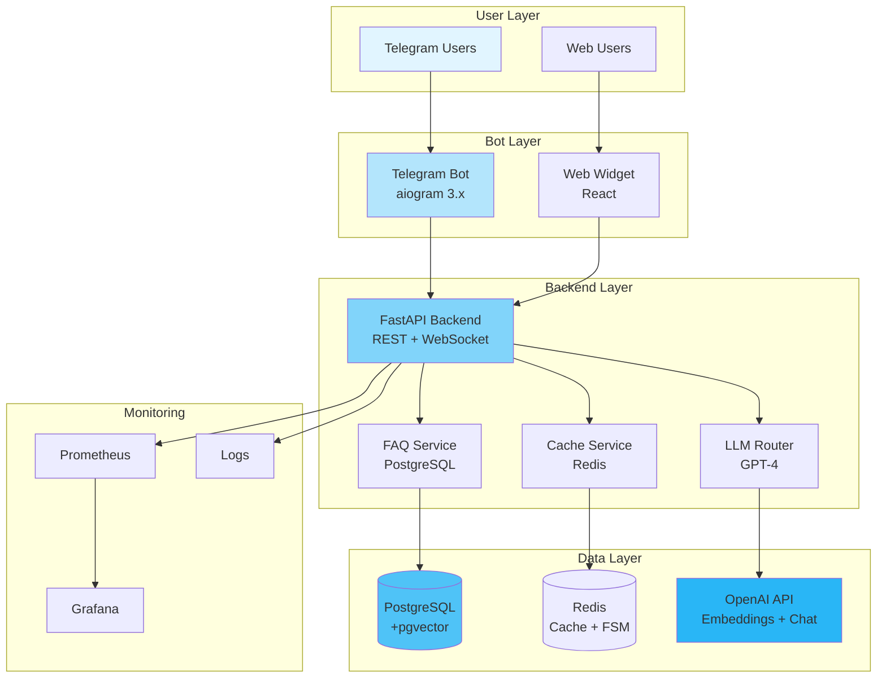

---

## 🔄 Request Flow

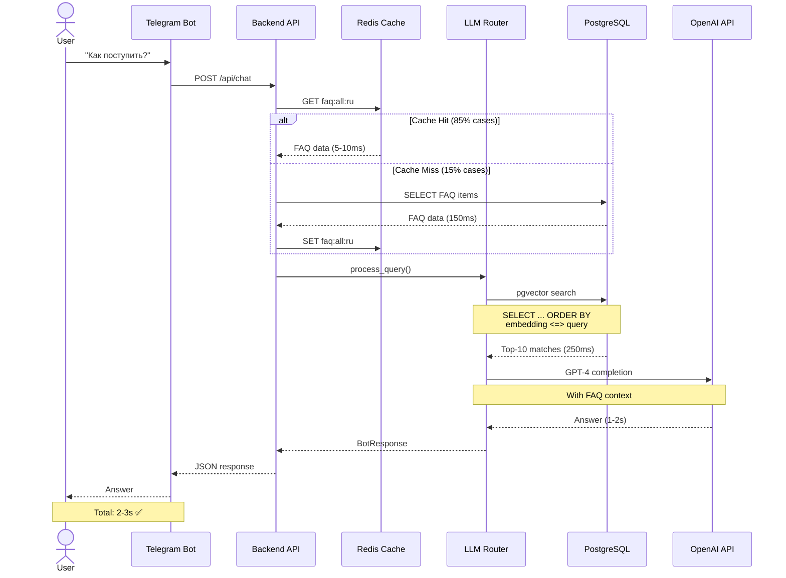

---

## 🏗️ Component Architecture

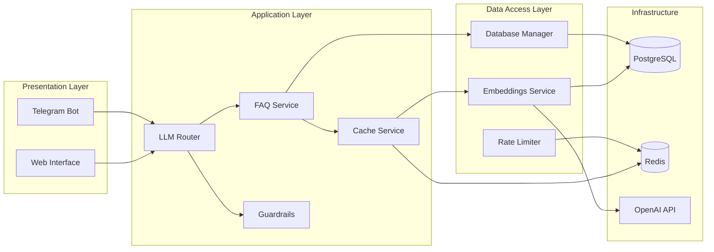

---

## 📦 Deployment Architecture

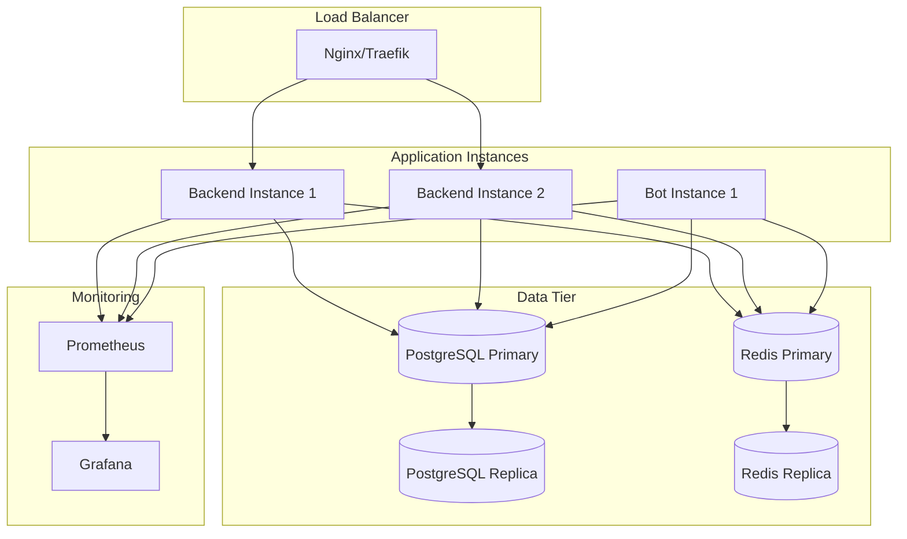

---

## 🔐 Security Architecture

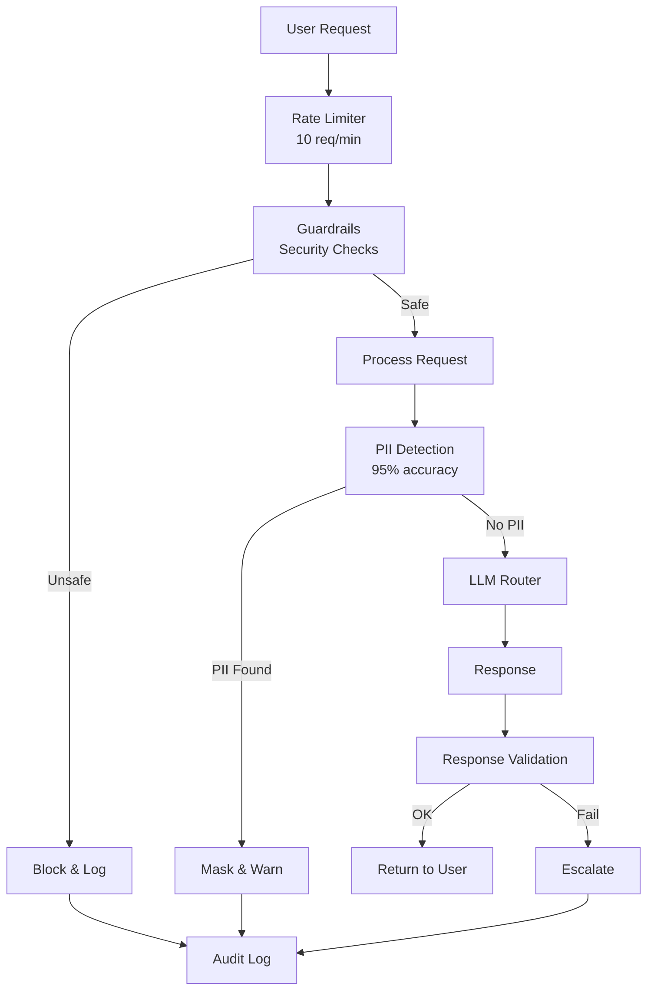

---

## 📊 Data Flow

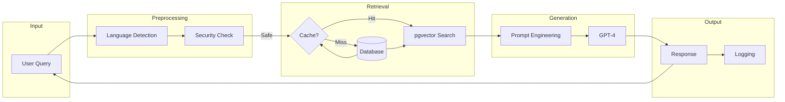

---

## 🎯 Key Design Patterns

### **1. Dependency Injection**

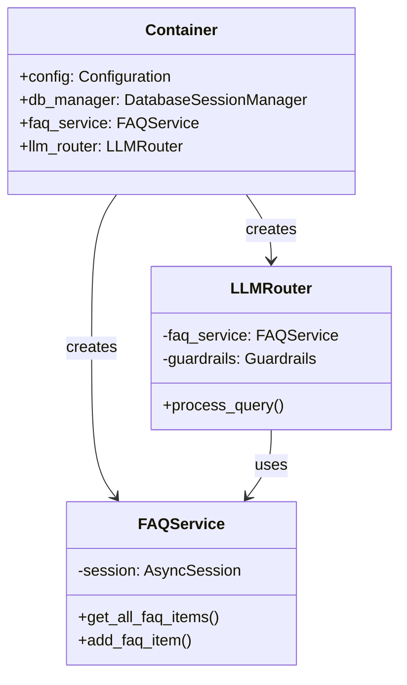

---

### **2. Repository Pattern**

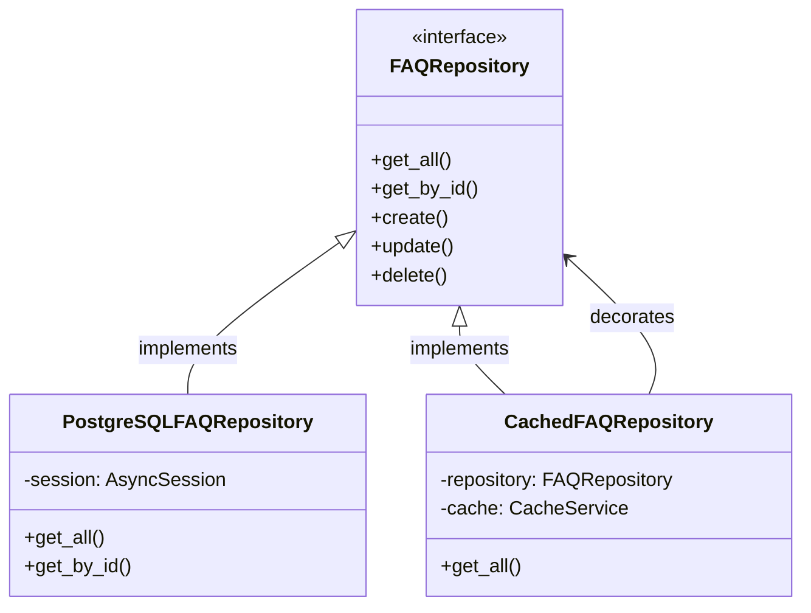

---

### **3. Cache-Aside Pattern**

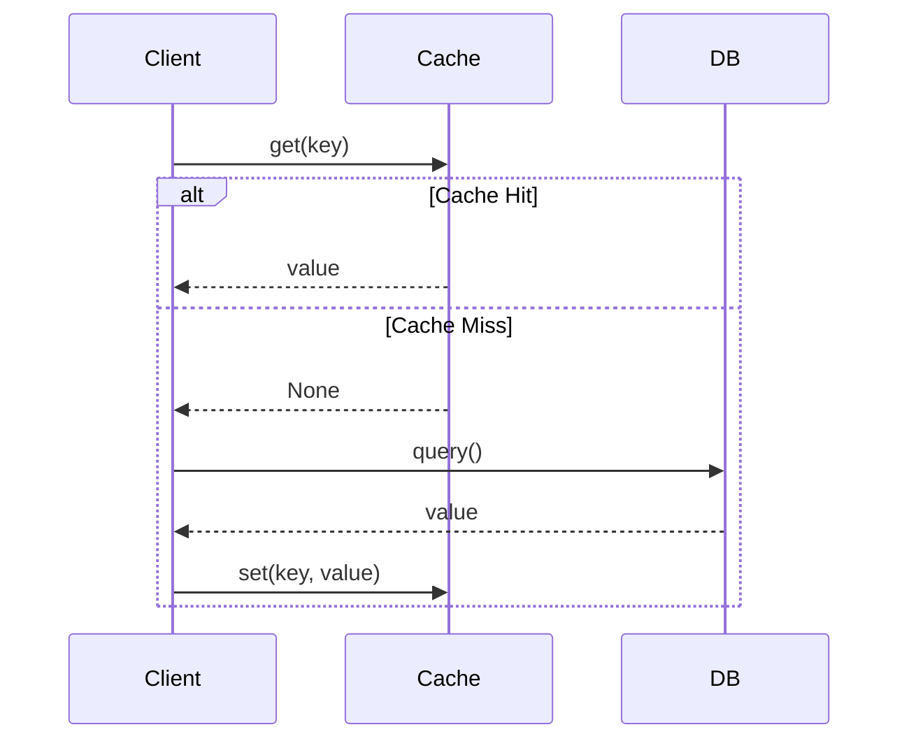

---

## 📊 Technology Stack

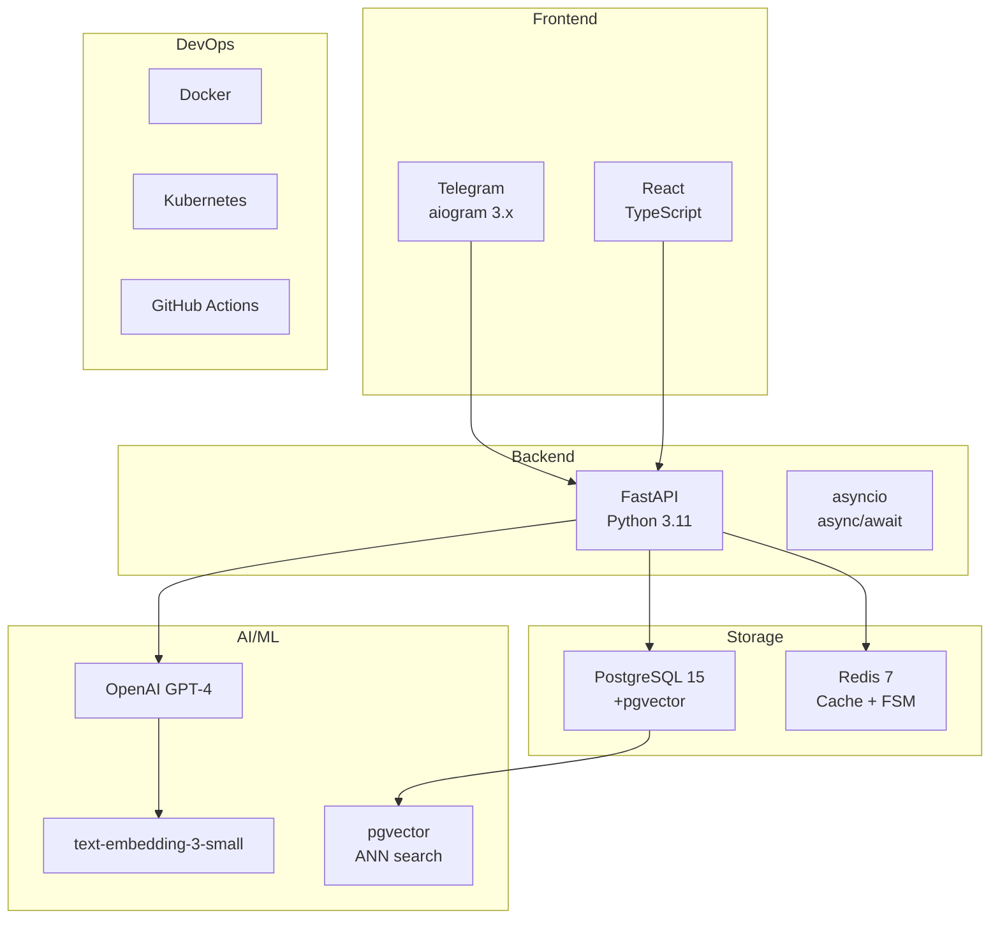

---

## 🔄 State Machine (FSM)

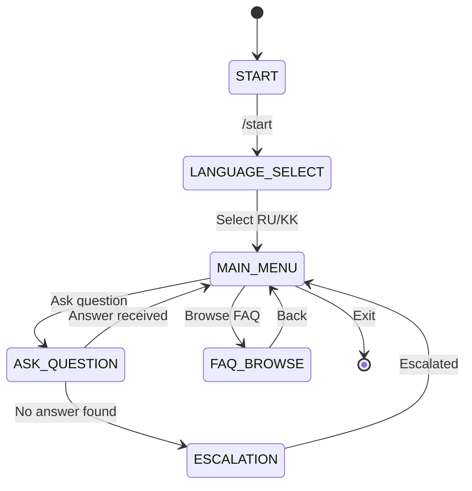

---

**Детальные диаграммы готовы! Architecture documented! ✅**

